# GourmetDelightBD

## Realizado por: Diego Fernando Carreño Torres
### Grupo J3

#### Modelo Entidad Relacion
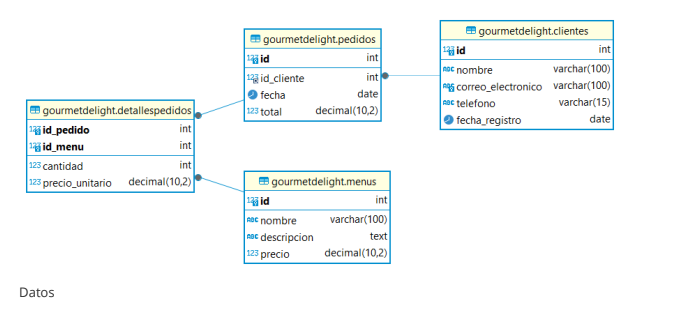

## Consultas:
1. Obtener la lista de todos los menús con sus precios.
```sql
SELECT m.nombre, m.precio
FROM Menu m;
```
Resultado
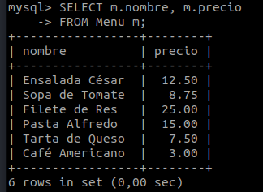

2. Encontrar todos los pedidos realizados por el cliente 'Juan Perez'.
```sql
SELECT p.idPedido, p.fecha, p.total
FROM Pedido p
RIGHT JOIN cliente c ON c.idCliente = p.idCliente
WHERE c.nombre LIKE 'Juan Perez'; 
```
Resultado
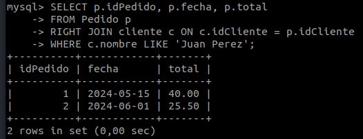

3. Listar los detalles de todos los pedidos, incluyendo el nombre del menú, cantidad y precio unitario.
```sql
SELECT dp.idPedido, m.nombre, dp.cantidad, dp.precioUnitario
FROM DetallePedido dp
JOIN Menu m ON m.idMenu = dp.idMenu;
```
Resultado
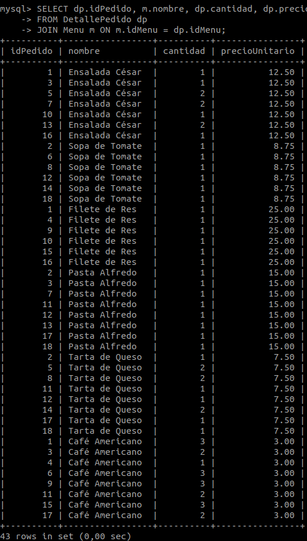

4.Calcular el total gastado por cada cliente en todos sus pedidos.
```sql
SELECT c.nombre AS NombreCliente, SUM(p.total) AS TotalGastado
FROM Pedido p
JOIN cliente c ON p.idCliente = c.idCliente
GROUP BY c.nombre;
```
Resultado
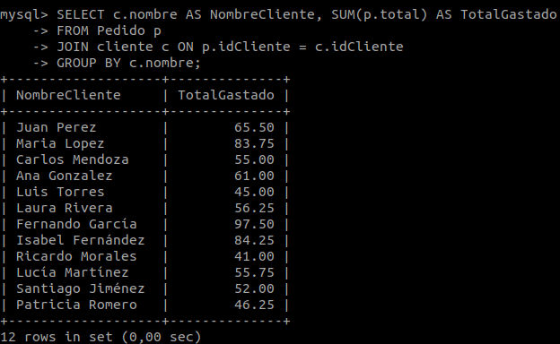

5.Encontrar los menús con un precio mayor a $10.
```sql
SELECT m.nombre AS NombreProducto, m.precio AS PrecioProducto
FROM Menu m
WHERE m.precio > 10;
```
Resultado
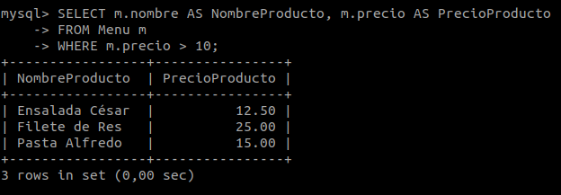

6. Obtener el menú más caro pedido al menos una vez.
```sql
SELECT m.nombre AS MenuMásCaro, m.precio
FROM Menu m
JOIN DetallePedido dp ON m.idMenu = dp.idMenu
GROUP BY m.idMenu, m.nombre, m.precio
HAVING COUNT(DISTINCT dp.idPedido) >= 1
ORDER BY m.precio DESC
LIMIT 1;
```
Resultado
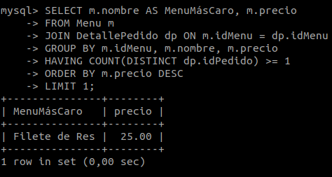

7. Listar los clientes que han realizado más de un pedido.
```sql
SELECT c.nombre, c.correoElectronico
FROM cliente c
JOIN Pedido p ON c.idCliente = p.idCliente
GROUP BY c.idCliente, c.nombre, c.correoElectronico
HAVING COUNT(p.idPedido) > 1;
```
Resultado
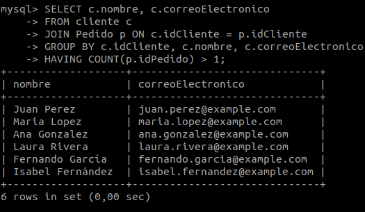

8. Obtener el cliente con el mayor gasto total.
```sql
SELECT c.nombre
FROM cliente c
JOIN Pedido p ON c.idCliente = p.idCliente
JOIN DetallePedido dp ON p.idPedido = dp.idPedido
GROUP BY c.idCliente
LIMIT 1;
```
Resultado
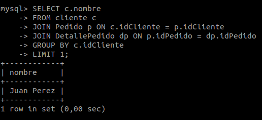

9. Mostrar el pedido más reciente de cada cliente.
```sql
SELECT c.nombre AS nombreCliente, p.fecha, p.total
FROM cliente c
JOIN Pedido p ON c.idCliente = p.idCliente
JOIN (
    SELECT idCliente, MAX(fecha) AS fechaReciente
    FROM Pedido
    GROUP BY idCliente
) p_max ON p.idCliente = p_max.idCliente AND p.fecha = p_max.fechaReciente;
```
Resultado
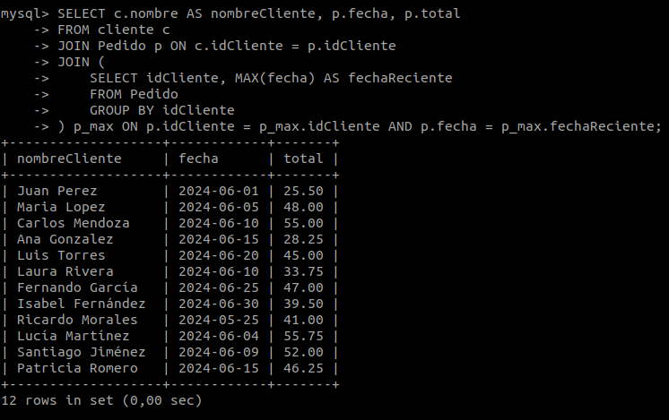

10. Obtener el detalle de pedidos (menús y cantidades) para el cliente 'Juan Perez':
```sql
SELECT dp.idPedido, m.nombre, dp.cantidad, dp.precioUnitario 
FROM DetallePedido dp 
JOIN Menu m ON dp.idMenu = m.idMenu
JOIN Pedido p ON dp.idPedido = p.idPedido
JOIN cliente c ON c.idCliente = p.idCliente
WHERE c.nombre = 'Juan Perez';
```
Resultado
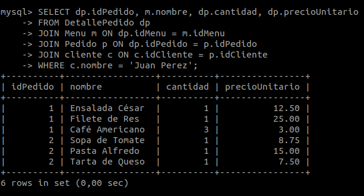


## Procedimientos Almacenados

1. Crea un procedimiento almacenado llamado AgregarCliente que reciba como
parámetros el nombre, correo electrónico, teléfono y fecha de registro de un nuevo cliente y lo inserte en la tabla Clientes.

```sql
DELIMITER $$
CREATE PROCEDURE AgregarCliente(
    IN p_nombre VARCHAR(100),
    IN p_correoElectronico VARCHAR(100),
    IN p_telefono VARCHAR(15),
    IN p_fechaRegistro DATE
)
BEGIN
    INSERT INTO clientes (nombre, correoElectronico, telefono, fechaRegistro) 
    VALUES (p_nombre, p_correoElectronico, p_telefono, p_fechaRegistro);
END $$
DELIMITER ;
```
```sql
  call AgregarCliente("Diego Carreño", "diegofct@gmail.com", "3171515225", '2024-06-12');
```

2.Crea un procedimiento almacenado llamado ObtenerDetallesPedido que reciba
como parámetro el ID del pedido y devuelva los detalles del pedido, incluyendo el nombre del menú, cantidad y precio unitario.

```sql
DELIMITER $$
CREATE PROCEDURE ObtenerDetallesPedido(
    IN p_idPedido INT
)
BEGIN
    SELECT dp.idPedido,
           dp.idPenu, 
           m.nombre AS nombreMenu, 
           dp.cantidad, 
           dp.precioUnitario
    FROM DetallePedido dp 
    JOIN Menu m ON m.idMenu = dp.idMenu
    JOIN Pedido p ON p.idPedido = dp.idPedido
    WHERE p_idPedido = p.idPedido;
END $$
DELIMITER ;
```
```sql
call ObtenerDetallesPedido(2);
```

3. Crea un procedimiento almacenado llamado ActualizarPrecioMenu que reciba
como parámetros el ID del menú y el nuevo precio, y actualice el precio del menú en la tabla Menus

```sql
DELIMITER$$
CREATE PROCEDURE ActualizarPrecioMenu(
    IN aidMenu INT,
    IN precionuevo DECIMAL(10,2)
)
BEGIN
    UPDATE menus 
    SET precio = precionuevo 
    WHERE idMenu = aidMenu;
END $$
DELIMITER ;
```

4. Crea un procedimiento almacenado llamado EliminarCliente que reciba como
parámetro el ID del cliente y elimine el cliente junto con todos sus pedidos y los detalles de los pedidos.

```sql
DELIMITER $$
CREATE PROCEDURE EliminarCliente(
    IN p_idClienteEliminar INT
)
BEGIN
    DELETE FROM DetallePedido 
    WHERE idPedido IN (SELECT idPedido FROM Pedido WHERE idcliente = p_idClienteEliminar);
    
    DELETE FROM Pedido 
    WHERE idCliente = p_idClienteEliminar;
    
    DELETE FROM cliente
    WHERE idCliente = p_idClienteEliminar;
END$$
DELIMITER ;
```
```sql
call EliminarCliente(4);
```
5. Crea un procedimiento almacenado llamado TotalGastadoPorCliente que reciba
como parámetro el ID del cliente y devuelva el total gastado por ese cliente en todos sus pedidos.

```sql
DELIMITER $$
CREATE PROCEDURE TotalGastadoPorCliente(
    IN c_idCliente INT 
)
BEGIN
    SELECT c.nombre, SUM(p.total) AS TotalGastado 
    FROM cliente c 
    JOIN Pedido p ON p.idCliente = c.idCliente
    WHERE c.idCliente = c_idCliente
    GROUP BY c.nombre;
END$$
DELIMITER ;
```
